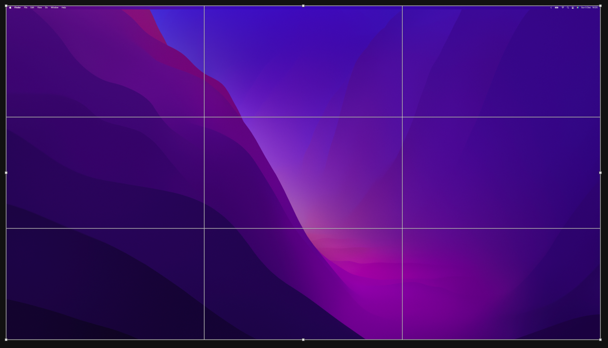
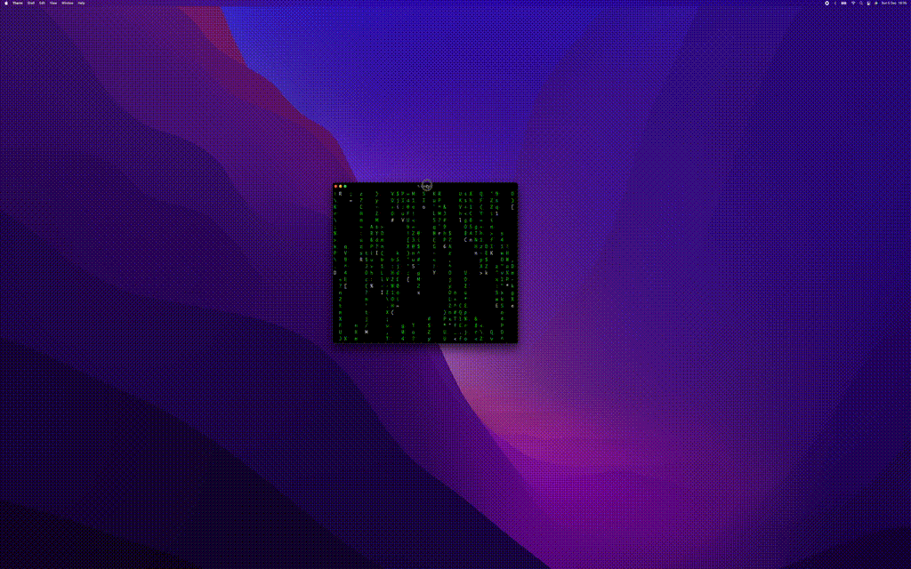

# 🌄 🚀 SkyRocket.spoon

This Hammerspoon tool lets you **resize** and **move** windows by clicking + dragging them while holding down modifier keys.

This attempts to emulate such things as:

* BetterTouchTool resize/move functions
* Coderage Software's abandoned Zooom/2 software
* Linux desktop move/resize hot keys

I created this to fill the void after Zooom/2 was abandoned by the original developer.


## Installation

This tool requires [Hammerspoon](https://www.hammerspoon.org/) to be installed and running.

The easiest thing to do is paste this in:

```
mkdir -p ~/.hammerspoon/Spoons
git clone https://github.com/dbalatero/SkyRocket.spoon.git ~/.hammerspoon/Spoons/SkyRocket.spoon
```

## Usage

Once you've installed it, add this to your `~/.hammerspoon/init.lua` file:

```lua
local SkyRocket = hs.loadSpoon("SkyRocket")

sky = SkyRocket:new({
  -- Which modifiers to hold to move a window?
  moveModifiers = {'cmd', 'shift'},

  -- Which modifiers to hold to resize a window?
  resizeModifiers = {'ctrl', 'shift'},

  -- Which modifiers to enable zones?
  fancyZoneModifier = {'shift'},

  -- Which zones
  -- Y=0 upside
  zones = {
    {w='0.50',h='0.65',x='0.0' ,y='0'},
    {w='0.50',h='0.65',x='0.50',y='0'},
    {w='0.25',h='0.35',x='0.0', y='0.65'},
    {w='0.25',h='0.35',x='0.25',y='0.65'},
    {w='0.25',h='0.35',x='0.50',y='0.65'},
    {w='0.25',h='0.35',x='0.75',y='0.65'},
  },
})
```

### Moving

To move a window, hold your `moveModifiers` down, then click and drag a window.

### Resizing

To resize a window, hold your `resizeModifiers` down, then click and drag a window.

### Fancy zones

Fancy zones module is inspired by [Microsoft's FancyZones](https://docs.microsoft.com/en-gb/windows/powertoys/fancyzones) and aims to provide a similar way to interact with windows in macOS

To configure your fancy zones you have to specify it them in the configuration using the ratios of the screen.



The 0,0 point starts in the top-left corner. In order to obtain the result shown in the image you need 9 zones:

```lua
  zones = {
    {w='0.3',h='0.3',x='0'  ,y='0'},
    {w='0.3',h='0.3',x='0.3',y='0'},
    {w='0.3',h='0.3',x='0.6',y='0'},
    {w='0.3',h='0.3',x='0'  ,y='0.3'},
    {w='0.3',h='0.3',x='0.3',y='0.3'},
    {w='0.3',h='0.3',x='0.6',y='0.3'},
    {w='0.3',h='0.3',x='0'  ,y='0.6'},
    {w='0.3',h='0.3',x='0.3',y='0.6'},
    {w='0.3',h='0.3',x='0.6',y='0.6'},
  },
```

Once the zones are configured you can press the modifier key and drag the window to the zones to snip it.

In the following gif you can see it in movement



### Disabling move/resize for apps

You can disable move/resize for any app by adding it to the `disabledApps` option:

```lua
sky = SkyRocket:new({
  -- For example, if you run your terminal in full-screen mode you might not
  -- to accidentally resize it:
  disabledApps = {"Alacritty"},
})
```

## Thanks

I took initial inspiration from [this gist](https://gist.github.com/kizzx2/e542fa74b80b7563045a) by @kizzx2, and heavily modified it to be packaged up in this Spoon. I also came up with a different technique for resizing to address the low frame-rate when attempting to resize in real time.

Fancy Zones are inspired by [Microsoft's FancyZones](https://docs.microsoft.com/en-gb/windows/powertoys/fancyzones) and implemented by [@snooze6](https://github.com/snooze6)